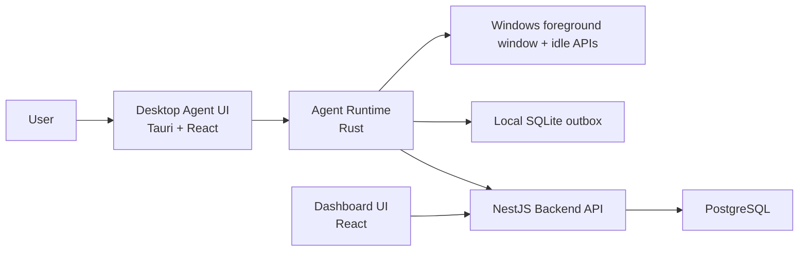
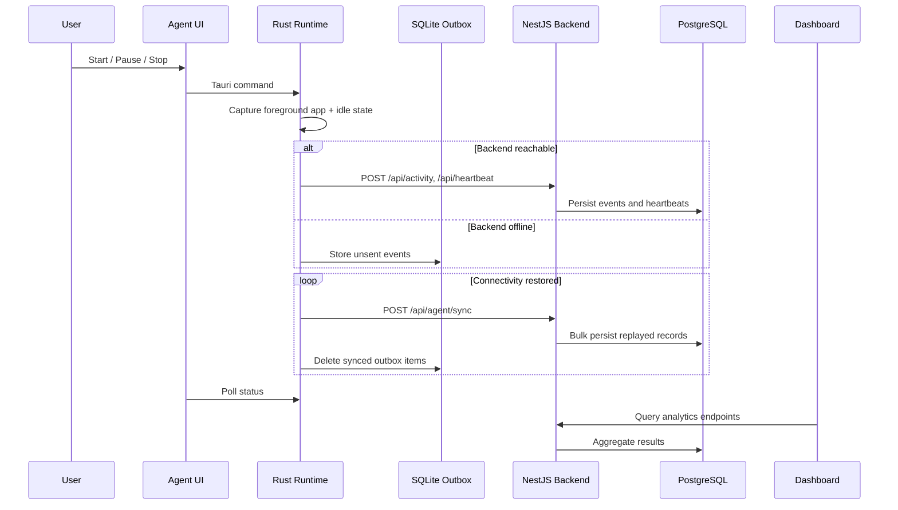
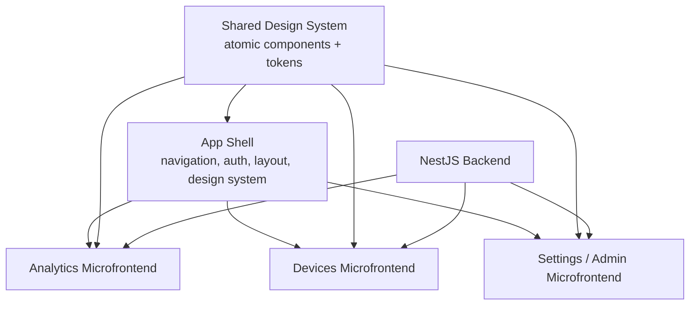

# ADR 0001: Mini Activity Analytics Platform Architecture

- Created By: Andrew Ayson
- Date: 2026-07-03

## Context

The platform must capture desktop activity on Windows (1), expose an ingestion API (2), and provide a dashboard with real-time analytics (3). In addition to that, I myself have determined that the architecture needs to have the below factors to consider:

- performance of the desktop agent
- security and privacy of local data collection
- operational simplicity for the backend
- maintainable UI architecture for both the dashboard and desktop agent

The key architectural choices that I have design were:

- desktop agent runtime: Rust
- desktop agent UI shell: Tauri + React
- backend API: NestJS
- primary server database: PostgreSQL
- local offline database in the agent: SQLite
- frontend composition: React with atomic design and shadcn-style primitives

## Decision

We will use a split architecture:

- `apps/agent`
  A Tauri desktop application with a Rust runtime for activity capture, offline queueing, sync orchestration, and native desktop control. The visible UI is React, organized by atomic design.
- `apps/backend`
  A NestJS HTTP API responsible for ingestion, validation, sync endpoints, and analytics queries over PostgreSQL.
- `apps/dashboard`
  A React analytics dashboard, also organized by atomic design and shadcn-style reusable UI primitives.
- `packages/shared`
  Shared TypeScript contracts for API payloads and dashboard data.

SQLite is used only on the desktop agent as a durable offline outbox. PostgreSQL is the system-of-record database for backend analytics.

## Architecture Overview

## Runtime Data Flow

## Frontend Composition

Both frontends follow atomic design:

- atoms
  Basic primitives such as buttons, cards, badges, inputs, and select controls
- molecules
  Small compositions such as stat cards, panel headers, settings fields, and activity rows
- organisms
  Larger feature blocks such as the activity chart panel, device table panel, control panel, and settings form
- templates
  Shared page-level layout shells
- pages
  Top-level route/page assembly

This gives us a stronger UI system than ad hoc component sprawl while staying lightweight enough for a take-home assignment.

## Microfrontend Architecture

The current implementation is a modular monorepo frontend, not runtime-federated microfrontends yet. That is intentional. For the current scope, runtime federation would add deployment and integration complexity without enough business value.

The recommended microfrontend target architecture is:

Recommended boundaries:

- App shell
  Shared layout, route mounting, environment configuration, auth, and cross-cutting UX
- Analytics microfrontend
  Summary cards, time-series, top apps, filters
- Devices microfrontend
  Device roster, device drill-down, recent slices, state monitoring
- Settings microfrontend
  Agent enrollment, productivity rules, privacy controls, future admin features

## Technology Decisions and Tradeoffs

### Desktop: Rust + Tauri + React

Why this was chosen:

- Rust keeps the activity-capture and local persistence path fast and memory-efficient
- Tauri provides a thinner desktop shell than Electron
- native Rust code gives more control over OS calls and local SQLite behavior
- React still gives fast UI delivery and strong component ergonomics

Advantages:

- lower memory footprint than Electron in most cases
- stronger control over native APIs and offline queueing
- reduced attack surface compared with shipping a full Node.js desktop runtime
- better fit for foreground-window sampling, local persistence, and sync workers

Disadvantages:

- higher implementation complexity than an all-TypeScript desktop stack
- two-language development model
- desktop packaging and native debugging are more involved

Why not Electron:

- Electron is usually faster to bootstrap, but it ships a larger runtime and broader surface area
- the assignment benefits more from native performance and tighter local control than from JavaScript-only convenience

Why not pure Rust native UI:

- a pure Rust GUI would maximize native control, but React plus shadcn-style primitives gives faster UI iteration and a better design-system path

### Backend: NestJS

Why this was chosen:

- the backend load for this assignment is ingestion plus SQL analytics, not ultra-high-throughput compute
- NestJS provides strong module structure, controller patterns, and validation-friendly HTTP APIs
- the product benefits from fast API iteration and maintainable service organization

Advantages:

- fast delivery and readable architecture
- strong HTTP/controller/service separation
- easy fit for typed API contracts and dashboard integration
- good maintainability for a growing product team

Disadvantages:

- slower and heavier than a Rust or Go backend at raw throughput
- more runtime overhead than lower-level compiled alternatives

Why not Rust or Go for the backend right now:

- Rust or Go would likely win on raw performance, startup efficiency, and lower memory use
- however, the critical performance-sensitive path in this product is the desktop capture agent, not the API tier
- NestJS is an acceptable tradeoff because PostgreSQL query design and indexing matter more here than squeezing maximum HTTP throughput

### Database: PostgreSQL for backend, SQLite for offline agent storage

Why PostgreSQL is the right primary database:

- event data is relational and timestamp-heavy
- analytics queries need aggregation, grouping, and filtering by device and time range
- PostgreSQL handles those workloads much more naturally than a document database

Why SQLite is still necessary:

- the desktop agent must not lose data when the internet or backend is unavailable
- SQLite is embedded, durable, and ideal for a local outbox pattern

Why not use SQLite as the primary server database:

- concurrent multi-device ingestion and analytics are a better fit for PostgreSQL
- Dockerized deployment and future growth are cleaner with a server database

Why not NoSQL:

- the core model is structured events plus relational rollups
- NoSQL would complicate analytical queries without solving an actual data-shape problem

## Security and Privacy Notes

The architecture intentionally prefers visible and bounded tracking:

- the agent is a visible desktop app
- the user can start, pause, and stop tracking
- excluded applications can be masked by the agent
- local outages do not require risky temporary file hacks because SQLite is used explicitly
- the backend receives structured activity slices rather than keystrokes or browser history imports

Current security strengths:

- native desktop runtime instead of a heavier desktop JS runtime
- local durable queue with explicit replay path
- API-first ingestion contracts with server-side validation
- no hidden or stealth collection behavior

Current limitations:

- no authentication or API token yet
- dashboard uses polling rather than push subscriptions
- privacy rules are still basic and app-name based

## Consequences

Positive consequences:

- strong desktop performance and offline resilience
- clean analytics model in PostgreSQL
- maintainable frontend structure for both agent and dashboard
- credible growth path toward microfrontends without premature complexity

Negative consequences:

- more moving parts than a single-language stack
- Rust + TypeScript requires broader team skills
- Tauri packaging adds native build concerns

## Implementation Mapping

- `apps/agent/src-tauri/src/main.rs`
  Rust runtime, Windows sampling, SQLite outbox, sync worker, Tauri commands
- `apps/agent/src/components/*`
  Atomic-design UI for the desktop agent
- `apps/dashboard/src/components/*`
  Atomic-design dashboard UI
- `apps/backend/src/analytics.controller.ts`
  Ingestion and dashboard API surface
- `apps/backend/src/repository.ts`
  PostgreSQL persistence and analytics queries

## Follow-Up Decisions

Likely future ADRs:

- authentication and API token model
- WebSocket or SSE real-time streaming
- productivity classification rules
- packaging/installer strategy for the desktop agent
- whether to promote the dashboard into runtime-federated microfrontends
